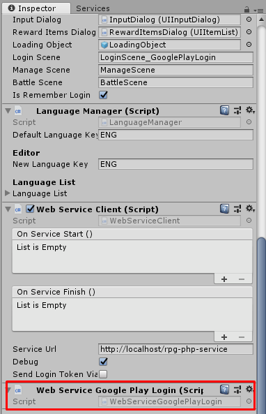
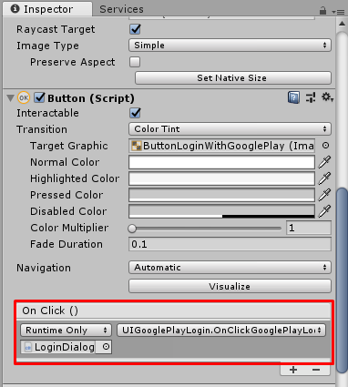

# unity-tbrpg-google-play-login
Google Play Login for Turnbase RPG

## How to setup
* Import and setup Play Games Plugin for Unity [Getting Started](https://github.com/playgameservices/play-games-plugin-for-unity/).
* Download and extract files from [the repository](https://github.com/insthync/unity-tbrpg-google-play-login) to your Turnbase RPG project ? Assets folder (You may create subfolder before extracting into it).
* Attach `WebServiceGooglePlayLogin` component to the same game object which attached `WebServiceClient`.

* Attach `UIGooglePlayLogin` component to any game object (maybe your login UI root), we will use its function to set to login button,

